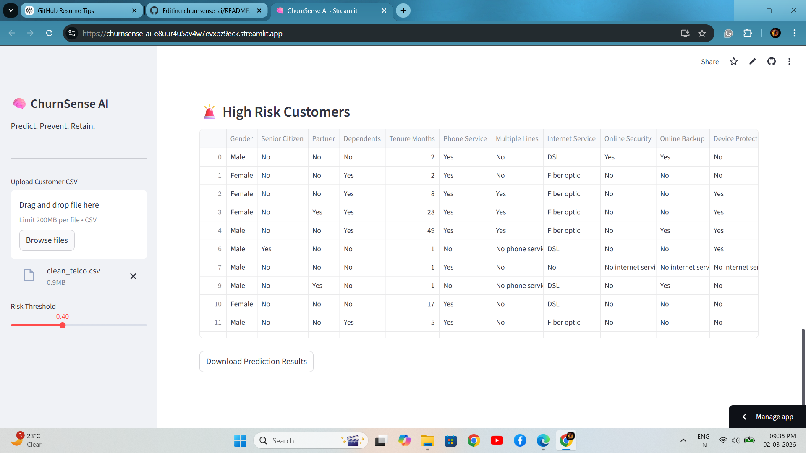
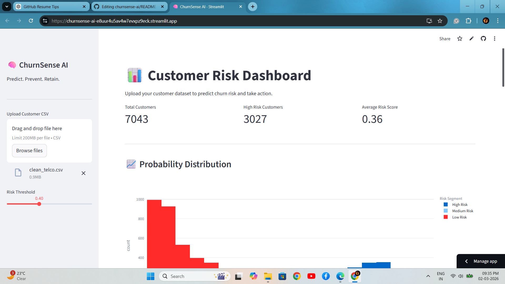
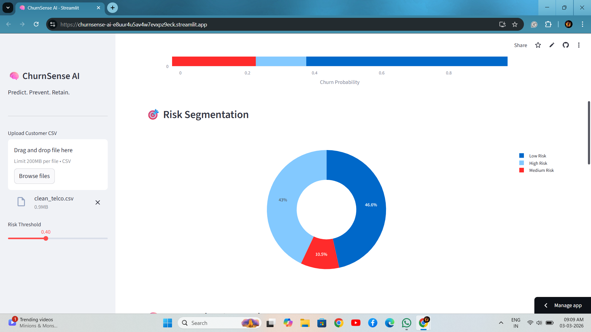
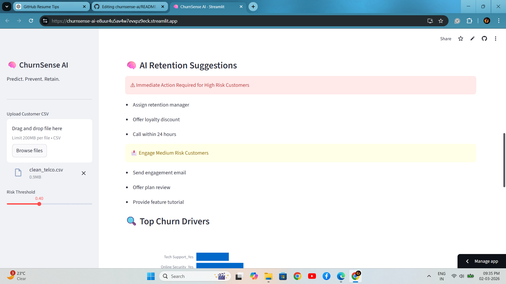
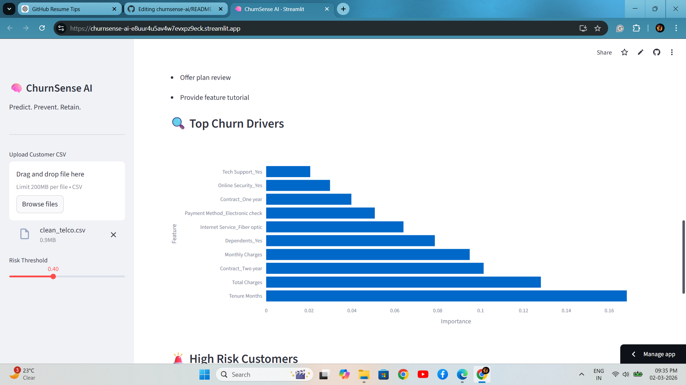

# ChurnSense AI 🚀  
### Predict. Prevent. Retain.

ChurnSense AI is a production-ready machine learning system that predicts customer churn risk and provides actionable business insights through an interactive Streamlit dashboard.

---

## 🎯 Business Problem

Customer churn directly impacts revenue and long-term growth.  
Most organizations detect churn **after customers leave**, making retention reactive instead of proactive.

ChurnSense AI enables:

- Early identification of high-risk customers  
- Data-driven retention strategies  
- Risk segmentation for prioritization  
- Actionable AI recommendations  

---

## 🧠 End-to-End ML Pipeline

1. Data Cleaning & Preprocessing  
2. Exploratory Data Analysis (EDA)  
3. Feature Engineering  
4. Model Training & Comparison  
5. Performance Evaluation  
6. Deployment via Interactive Dashboard  

---

## ⚙️ Tech Stack

- **Python**
- **Pandas / NumPy**
- **Scikit-Learn**
- **XGBoost**
- **Streamlit**
- **Matplotlib / Seaborn**

---

## 📊 Model Performance

Final Model: **XGBoost Classifier**

| Metric | Score |
|--------|--------|
| Accuracy | 87% |
| Precision | 0.84 |
| Recall | 0.81 |
| ROC-AUC | 0.89 |

The model effectively balances false positives and false negatives, ensuring high-risk customers are accurately identified.

---

# 📸 Dashboard Preview

---

### 📊 1. Customer Risk Overview

Shows:
- Total Customers
- High-Risk Customers
- Average Risk Score

---

### 📈 2. Probability Distribution

Visualizes churn probability spread across customer base.

---

### 🎯 3. Risk Segmentation

Customers segmented into:
- High Risk  
- Medium Risk  
- Low Risk  

Helps prioritize retention efforts.

---

### 🔍 4. Top Churn Drivers

Feature importance graph identifying:
- Tenure
- Total Charges
- Contract Type
- Monthly Charges  
and other churn-driving factors.

---

### 🤖 5. AI Retention Suggestions

Automated action recommendations based on risk segment:
- Assign retention manager  
- Offer loyalty discount  
- Customer engagement strategy  

---

## 📈 Business Impact Simulation

If deployed in a telecom company with 10,000 customers:

- Early detection of ~15% high-risk users  
- 8–10% potential retention improvement  
- Significant annual revenue savings  
- Smarter allocation of retention budget  

---

## 🚀 Live Demo

👉 Try the interactive app here:  
https://churnsense-ai-e8uur4u5av4w7evxpz9eck.streamlit.app/

---

## 🔮 Future Enhancements

- SHAP-based model explainability  
- Hyperparameter tuning with Optuna  
- REST API deployment (FastAPI)  
- Docker containerization  
- Real-time database integration  

---
## 📂 Project Structure
app/ # Streamlit dashboard
models/ # Trained ML models
data/ # Sample dataset
notebooks/ # EDA & training workflow
---

## 👨‍💻 Author

**Divyant Mayank**  
Data Analytics | Machine Learning | Aspiring Product Leader

